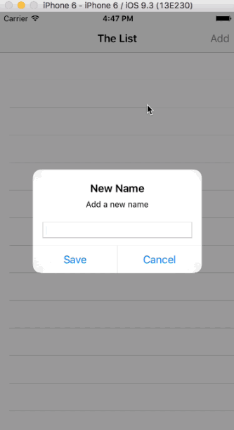

HitList
==========
HitList is a Swift App shows the implementation of Core Data. It is the demo app of Ray Wenderlich's tech blog. For details please reference [*Getting Started with Core Data Tutorial*](https://www.raywenderlich.com/115695/getting-started-with-core-data-tutorial)

## Screenshots

### Why XCTest?

Here we have basically same explanation as in the Android project, and that is the 
XCTest is created specifically for the iOS testing by Apple and it is updated and maintaned by Apple for
this specific purpose. One of the benefits of the XCTest is that it will always run, even after XCode updates, which
are prone to breaking appium code. Beside that, XCTest is faster and far easier to setup.

In the end, best practice is to have app covered with unit test, and afterwards to
have rest covered by the UI test. Unfortunately, architecture of this application
doesn't allow me unit test example, and provided iOS application already had Unit test inside.
